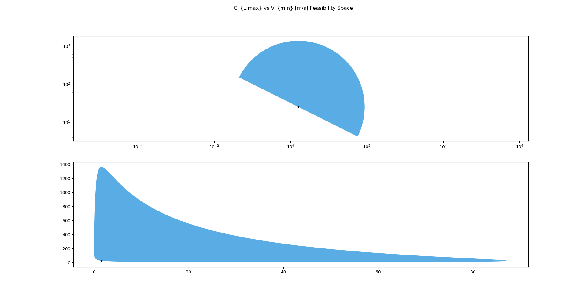

# Design Space Visualization Tools

Given a GPkit model, this repository will visualize its solution to allow for better understanding of possible design spaces. 


## Usage

```python
plot_feasibilities(axisvariables, m, [rm, iterate, design_feasibility, skipfailures, numberofsweeps])
```
axisvariables = GPkit variables to plot (first x, then y)
rm = Robust Model, if it exists (defaults to None)  
iterate = Boolean of whether or not to use an iterated plot to a specific resolution (defaults to False)  
skipfailures = Boolean of whether or not to skip errors during sweeps (defaults to False)  
numberofsweeps = Integer number of points used to approximate the design space. If iterate = True, then this is the starting number of points.  


*Example design space of a normal model*

*Example design space of a robust model with an elliptical uncertainty set*

*Example design space of a robust model with a box uncertainty set*

## Current (Alpha) Features
 - Plotting design space 2 non-vector variables in 2D space
 - Approximating shape with arbitrary number of points or to a specific resolution (using iterate)

## Beta Features
 - [ ] Allowing user to specify resolution for iterated plot
 - [ ] Improving speed of iterated plot
 - [ ] Plotting design space across 3 non-vector variables in 3D space